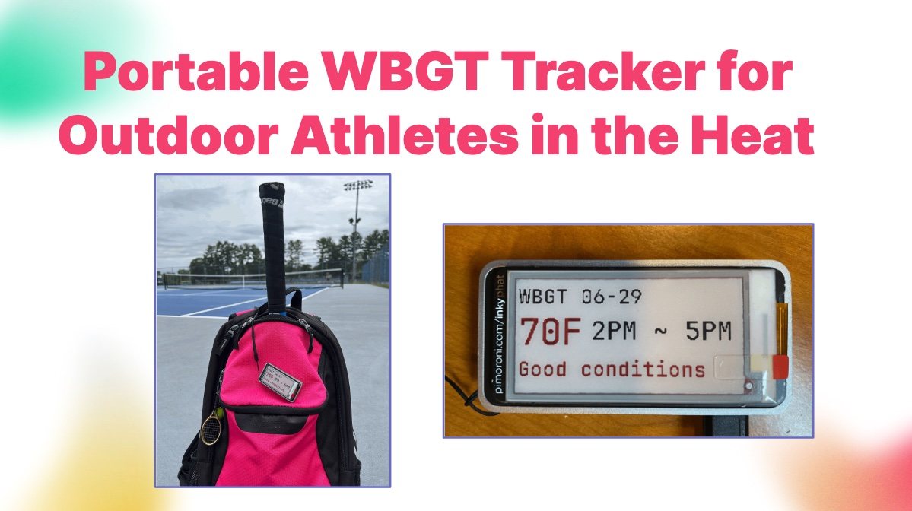
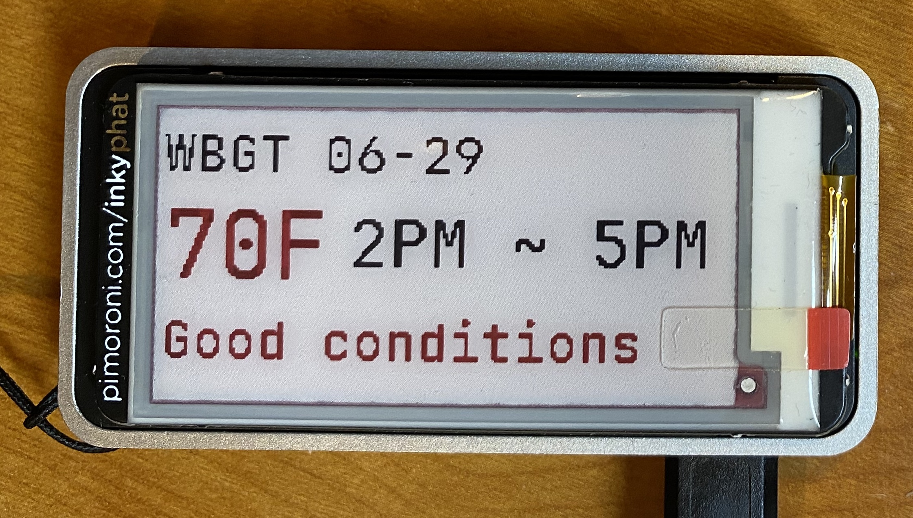
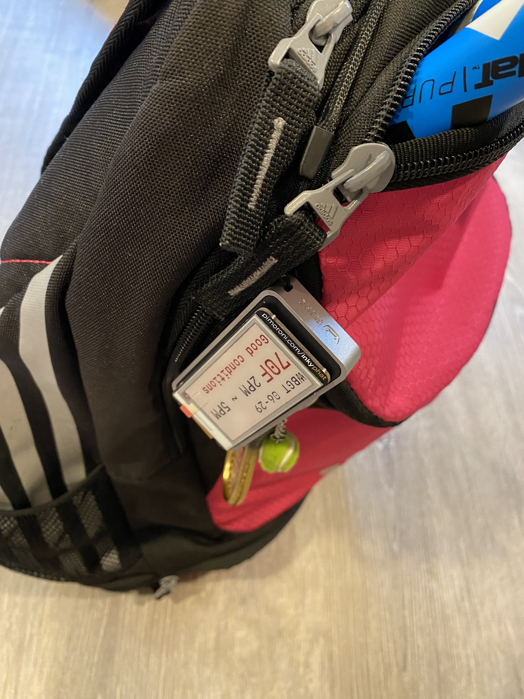
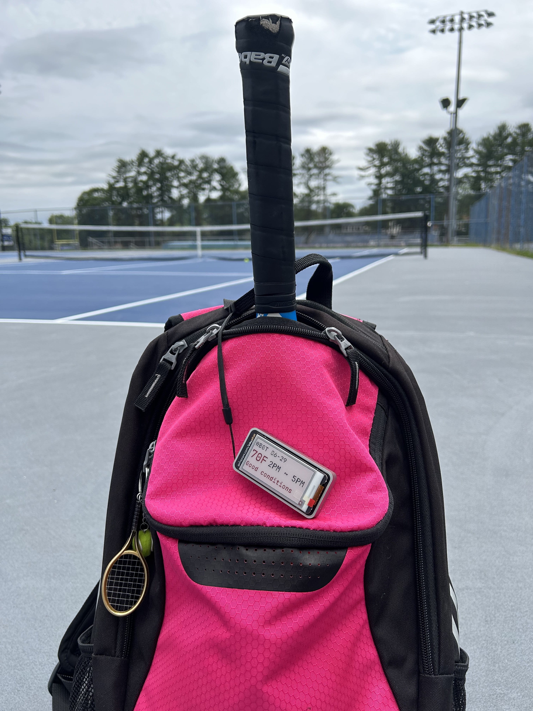

<!-- # Portable WBGT Tracker for Outdoor Athletes in the Heat -->

## Project summary

This project builds a portable device that finds and displays the local Web Bulb Globe Temperature (WBGT). WBGT is an indicator of heat stress on the human body in direct sunlight. It measures air temperature, humidity, wind speed and solar heat (including sunlight angle and cloud cover). This device allows outdoor athletes to be aware of the environmental conditions for their activities and helps them take precautions early enough (e.g. resting in shade and getting hydrated).

This device is implemented with a Raspberry Pi Zero computer and an e-paper display. A Python program runs on Raspberry Pi to determine the current location of the device (latitude and longitude) through IP geolocation, download WBGT forecast for that location from National Oceanic and Atmospheric Administration (NOAA) and show the forecast on the e-paper display. The program can be activated via iOS Siri.

This project was submitted to and presented at [PhysTech 2024](https://binnovative-boston.github.io/phystech/2024.html). It won the [3rd place](https://phystech-2024-20890.devpost.com/project-gallery) award.

## Publications

- Hanna Suzuki, "Portable WBGT Tracker for Outdoor Athletes in the Heat," In S. Nagata and S. Ouchi (eds.), *[Technology Hacks for Fitness, Sports and Outdoor Activities: Innovative Projects from PhysTech 2024](https://www.amazon.com/dp/B0DQX74Y9H)*, Chapter 5, pp. 64 - 78, Binnovative, ISBN: 979-8-3031-7444-3, December 2024.

## Pictures/Videos

<!--
# It is implemented
# 
# their risk of heat-related illness (e.g. heat stroke) 
# 
# Raspberry Pi computer and e-paper display 
# 
# This device finds the WBGT, Wet Bulb Globe Temperature, of the area and determines the conditions for outdoor athletes. It displays this information on a ePaper display that is can hung onto bags for portability. 
-->
